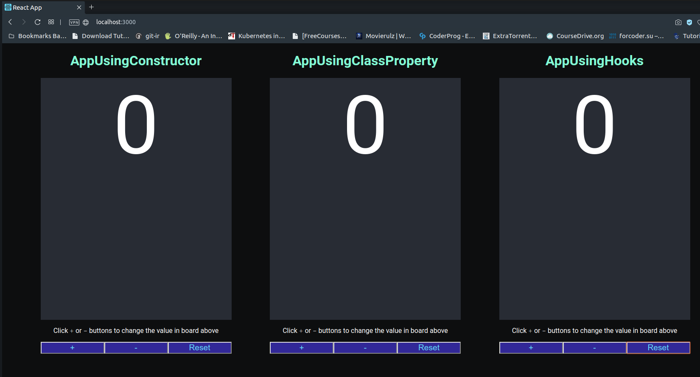

# The `simple-counter` app

## Objective

The purpose of this project is to demo the various ways of initialising state in a react component. This demo has the code for the following 3 styles:
1. Class Component that uses `constructor` to initialise state.
2. Class Component that uses static/class property to initialise state.
3. Functional Component (aka Function) that uses React Hook viz. `useState` to initialise state.

Notes: 

The evolution has been in that order as shown above. With the advent of ES6, react leveraged constructor to initialise component state. This one unified the practices by various teams. However this method has a constraint that the constructor's first statement should be `super(props);`, failing which things might not work as expected. To err is human and developers missed this line occassionaly resulting in painful debugging. 

But a developer is smart. With the advent of **ESLint** this issue was resolved. That said, **Babel** users start to leverage static/class property feature available in Babel, for it is concise and looks cleaner. Note this class property isn't a feature of Javascript as  yet and so would result in constructor being generated for you by Babel. 

In the mean time, React introduced easier way to define stateless components with just functions. These are called **Stateless / Functional Components**. And with time React also introduced **React Hooks**. One of the hooks were `useState` that hooks state into a component. With the advent of this, the community started to leverage this one over the above methods.

Your mileage and preference may vary. This project is aimed to help you decide the flavor you prefer and start adopting.

## Credits

This project was bootstrapped with [Create React App](https://github.com/facebook/create-react-app).

### Available Scripts

In the project directory, you can run:

#### `npm start`

Runs the app in the development mode. 
Open [http://localhost:3000](http://localhost:3000) to view it in the browser.

The page will reload if you make edits. 
You will also see any lint errors in the console.

#### `npm test`

Launches the test runner in the interactive watch mode. 
See the section about [running tests](https://facebook.github.io/create-react-app/docs/running-tests) for more information.

#### `npm run build`

Builds the app for production to the `build` folder. 
It correctly bundles React in production mode and optimizes the build for the best performance.

The build is minified and the filenames include the hashes. 
Your app is ready to be deployed!

See the section about [deployment](https://facebook.github.io/create-react-app/docs/deployment) for more information.

#### `npm run eject`

**Note: this is a one-way operation. Once you `eject`, you can’t go back!**

If you aren’t satisfied with the build tool and configuration choices, you can `eject` at any time. This command will remove the single build dependency from your project.

Instead, it will copy all the configuration files and the transitive dependencies (webpack, Babel, ESLint, etc) right into your project so you have full control over them. All of the commands except `eject` will still work, but they will point to the copied scripts so you can tweak them. At this point you’re on your own.

You don’t have to ever use `eject`. The curated feature set is suitable for small and middle deployments, and you shouldn’t feel obligated to use this feature. However we understand that this tool wouldn’t be useful if you couldn’t customize it when you are ready for it.

### Learn More

You can learn more in the [Create React App documentation](https://facebook.github.io/create-react-app/docs/getting-started).

To learn React, check out the [React documentation](https://reactjs.org/).

#### Code Splitting

This section has moved here: https://facebook.github.io/create-react-app/docs/code-splitting

#### Analyzing the Bundle Size

This section has moved here: https://facebook.github.io/create-react-app/docs/analyzing-the-bundle-size

#### Making a Progressive Web App

This section has moved here: https://facebook.github.io/create-react-app/docs/making-a-progressive-web-app

#### Advanced Configuration

This section has moved here: https://facebook.github.io/create-react-app/docs/advanced-configuration

#### Deployment

This section has moved here: https://facebook.github.io/create-react-app/docs/deployment

#### `npm run build` fails to minify

This section has moved here: https://facebook.github.io/create-react-app/docs/troubleshooting#npm-run-build-fails-to-minify
